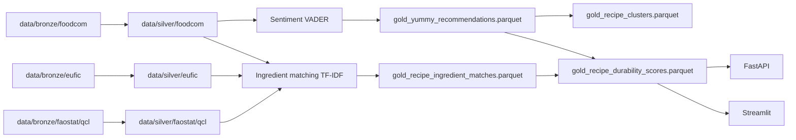

# Audit architecture et qualite - YUMMY Data Platform

Date de l'audit local : 2026-06-29

## 1. Synthese executive

YUMMY est une plateforme data coherentement structuree autour d'une architecture
Medallion :

- Bronze : donnees brutes Food.com, EUFIC, FAOSTAT.
- Silver : nettoyage et standardisation.
- Gold : scores analytiques, matching ingredients, sentiment, clustering,
  durabilite.

Le projet est deja solide pour un prototype avance / MVP data platform :

- pipelines Python bien separes par domaine ;
- API FastAPI et interface Streamlit fonctionnelles sur la couche Gold ;
- orchestration Airflow presente ;
- stockage Parquet local et upload MinIO ;
- couche dbt/DuckDB disponible ;
- tests unitaires sur sentiment, matching et durabilite ;
- script d'audit d'integration bout en bout.

Le principal risque n'est pas l'absence de features, mais la stabilite
operationnelle : plusieurs chemins de generation/cohabitation existent, les
contrats de donnees ne sont pas centralises, et certaines valeurs de contexte
pays/mois restent codees en dur.

## 2. Etat verifie

Commande executee :

```bash
.\.venv\Scripts\python.exe -m pytest -q
```

Resultat :

- 44 tests passent.
- 1 test echoue.

Echec observe :

```text
tests/test_ingredient_taxonomy.py::test_build_ingredient_buckets_disjoint_sets
Expected seasonal_ingredients == ["Apples", "Carrots"], got []
```

Interpretation : le test attend que `build_ingredient_buckets()` classe les
ingredients de categorie `fruit` / `vegetable` dans les ingredients saisonniers
lorsque les colonnes `matched_ingredients` et `ingredient_categories` existent.
Le code actuel place tout dans les ingredients complementaires dans ce chemin de
fallback. La version v2 gere mieux les categories, mais l'endpoint v1 reste
incoherent avec le test.

Note environnement : la commande `python -m pytest -q` utilise le Python
d'Inkscape sur cette machine et echoue avec `No module named pytest`. Utiliser le
Python de `.venv`.

## 3. Architecture actuelle

Flux principal :



Orchestration Airflow actuelle :

```text
build_silver
  -> build_gold
  -> build_durability_score
  -> upload_to_minio
```

Attention : le DAG Airflow lance `build_gold_yummy_recommendations.py`
directement, mais ce script depend de `gold_sentiment_scores.parquet`. Il ne
lance pas explicitement le matching ingredients, le sentiment analyzer ni le
clustering. Le script `tools/build_all_ml.py` represente mieux l'ordre complet
du pipeline ML/Gold.

## 4. Points forts

1. Architecture projet lisible

Les dossiers `extract/`, `transform/`, `ml/`, `api/`, `app/`, `dbt/`, `tools/`
et `dags/` rendent les responsabilites comprehensibles.

2. Bonne base analytique

Le `yummy_score` combine rating bayesien, sentiment, popularite et simplicite.
Le score de durabilite combine saisonnalite EUFIC, disponibilite FAOSTAT et
couverture ingredients.

3. Tests metier presents

Les tests couvrent des fonctions importantes : sentiment VADER, matching TF-IDF,
taxonomy ingredients et score de durabilite.

4. Healthcheck utile

`tools/healthcheck.py` teste Docker, MinIO, DuckDB, Gold, API, UI et pytest. C'est
une bonne base de smoke test d'integration.

5. Separation Python / SQL possible

La presence de dbt permet une couche SQL testable, comparable au pipeline Python.

## 5. Risques prioritaires

### P0 - Suite de tests rouge

Fichier concerne :

- `tests/test_ingredient_taxonomy.py`
- `api/main.py`

Risque :

- La CI echouera sur `pytest`.
- L'endpoint `/ingredient-buckets` peut renvoyer une classification differente
  de celle attendue par l'UI ou les tests.

Action recommandee :

- Corriger `build_ingredient_buckets()` pour exploiter `ingredient_categories`
  quand cette colonne existe.
- Ou officialiser `/ingredient-buckets/v2` comme seul contrat UI et adapter le
  test v1.

### P0 - Orchestration Airflow incomplete par rapport au pipeline reel

Fichier concerne :

- `dags/yummy_pipeline.py`
- `tools/build_all_ml.py`

Constat :

- Airflow execute `build_gold_yummy_recommendations.py`, puis
  `build_gold_durability_score.py`.
- Mais `build_gold_yummy_recommendations.py` depend du sentiment deja genere.
- `build_gold_durability_score.py` depend du matching ingredients deja genere.
- Le DAG ne lance pas explicitement ces dependances.

Risque :

- Un run Airflow depuis un environnement propre peut echouer ou reutiliser des
  fichiers Gold anciens.

Action recommandee :

- Remplacer la tache Gold du DAG par `python tools/build_all_ml.py`.
- Ou decomposer le DAG en taches explicites :
  `ingredient_matching -> sentiment -> recommendations -> clustering -> durability`.

### P1 - API recharge le Parquet a chaque requete

Fichier concerne :

- `api/main.py`

Constat :

- `load_gold_data()` fait `pd.read_parquet(DURABILITY_FILE)` a chaque appel.

Risque :

- Latence inutile.
- Charge disque.
- Mauvaise scalabilite lorsque le Gold grandit.

Action recommandee :

- Ajouter un cache process avec invalidation par `mtime`.
- A moyen terme : DuckDB local, API query layer ou service de donnees dedie.

### P1 - Pays et mois de durabilite codes en dur

Fichier concerne :

- `transform/gold/build_gold_durability_score.py`

Constat :

- `main(country="france", month=6)` est appele en dur.

Risque :

- L'API/UI propose un contexte pays/mois, mais le Gold expose un score calcule
  pour France/Juin.
- Les utilisateurs peuvent croire que le score reflete leur selection courante.

Action recommandee :

- Ajouter des arguments CLI `--country` et `--month`.
- Stocker `durability_country` et `durability_month` comme dimensions de
  partition.
- Generer soit un Gold multi-contexte, soit un Gold par contexte.

### P1 - Deux chemins Gold coexistent sans gouvernance claire

Fichiers concernes :

- `transform/gold/build_gold_yummy_recommendations.py`
- `dbt/models/gold/yummy_recommendations.sql`
- `dbt/models/gold/schema.yml`

Constat :

- Python produit `gold_yummy_recommendations.parquet`.
- dbt produit `dbt_yummy_recommendations.parquet`.
- Les deux sont utiles, mais leur role officiel n'est pas tranche.

Risque :

- Divergences de calcul.
- Tests et consumers branches sur des fichiers differents.
- Difficultes a expliquer quelle source est canonique.

Action recommandee :

- Declarer une source canonique.
- Ajouter un test de reconciliation Python vs dbt sur un echantillon stable.
- Integrer dbt dans Airflow ou le documenter comme pipeline comparatif.

### P1 - Versionnement data faible

Fichiers concernes :

- `ml/matching/ingredient_matcher.py`
- `transform/gold/build_gold_yummy_recommendations.py`
- autres scripts utilisant `get_latest_file()`

Constat :

- Les scripts selectionnent le dernier fichier via tri de nom.
- `processed_at` existe, mais pas de manifeste central.

Risque :

- Reproductibilite limitee.
- Difficulte a reconstruire quel Bronze/Silver a produit quel Gold.

Action recommandee :

- Ajouter un manifeste de run : `data/gold/_manifest.json`.
- Enregistrer inputs, checksums, row counts, timestamp, country/month, commit git.

### P2 - CI lint non bloquant

Fichier concerne :

- `.github/workflows/ci.yml`

Constat :

- `ruff check .` est en `continue-on-error: true`.

Risque :

- Le style et certaines erreurs statiques peuvent deriver sans bloquer les PR.

Action recommandee :

- Passer Ruff en bloquant apres nettoyage initial.
- Ajouter une configuration `ruff.toml` ou `pyproject.toml`.

### P2 - UI couplee a l'API et aux fichiers locaux

Fichier concerne :

- `app/streamlit_app.py`

Constat :

- L'UI lit directement des Parquets locaux.
- Elle tente aussi `/ingredient-buckets/v2` via l'API, puis fallback local.
- Elle importe des fonctions depuis `api.main`.

Risque :

- Deux modes d'execution a maintenir.
- En Docker, local, CI et prod, les donnees peuvent diverger.
- L'API devient une bibliotheque importee par l'UI.

Action recommandee :

- Extraire les fonctions partagees dans un module commun, par exemple
  `yummy_core/ingredients.py`.
- Choisir un mode principal : UI consomme API, ou UI autonome fichier.

## 6. Recommandations par horizon

### Court terme

1. Corriger le test rouge `test_build_ingredient_buckets_disjoint_sets`.
2. Modifier Airflow pour executer le pipeline ML complet.
3. Ajouter un cache simple dans l'API.
4. Ajouter CLI `--country` / `--month` au score de durabilite.
5. Corriger les problemes d'encodage Markdown visibles dans README/docs.

### Moyen terme

1. Formaliser les contrats de colonnes Silver/Gold avec tests.
2. Ajouter un manifeste de run et des row-count checks.
3. Clarifier le role de dbt : canonique, comparatif ou deprecated.
4. Ajouter des tests API avec `TestClient`.
5. Ajouter des tests de smoke Streamlit ou au minimum import/build.

### Long terme

1. Passer a une couche de serving plus robuste pour l'API.
2. Partitionner les scores de durabilite par pays/mois.
3. Ajouter observabilite : duree pipeline, volumetrie, qualite, fraicheur.
4. Ajouter data catalog leger : sources, lineage, dernier run valide.

## 7. Proposition de backlog priorise

| Priorite | Ticket | Impact | Complexite |
|---|---|---:|---:|
| P0 | Corriger `/ingredient-buckets` ou le test associe | Haut | Faible |
| P0 | Aligner Airflow sur `tools/build_all_ml.py` | Haut | Faible |
| P1 | Cache API avec invalidation fichier | Moyen | Faible |
| P1 | Parametrer `country/month` durabilite | Haut | Moyen |
| P1 | Ajouter manifest de run Gold | Haut | Moyen |
| P1 | Tests API `TestClient` | Moyen | Faible |
| P2 | Ruff bloquant | Moyen | Faible |
| P2 | Reconciliation Python/dbt | Moyen | Moyen |

## 8. Decision recommandee

La prochaine meilleure action est de corriger le test rouge puis d'aligner le DAG
Airflow sur le pipeline ML complet. Ces deux changements reduisent immediatement
le risque que le projet soit "vert en local par hasard" mais instable en run
propre.

Ensuite, le plus gros gain produit sera de rendre le score de durabilite
dependant du pays et du mois choisis, car c'est le coeur de la promesse YUMMY :
des recommandations alimentaires contextualisees et durables.
