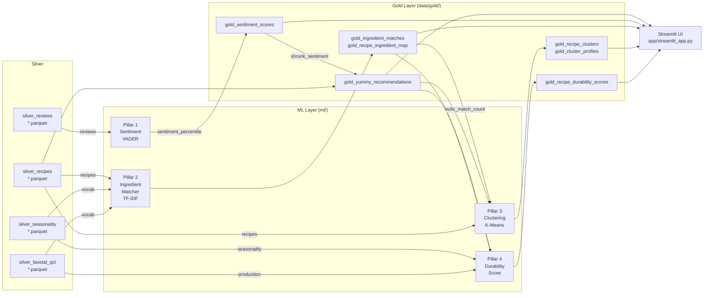

🇫🇷 [Version française](#version-française) · 🇬🇧 [English version](#english-version)

---

## 🇫🇷 Version française

# Couche ML YUMMY — Documentation technique

> **Chiffres issus de l'exécution canonique du 2026-05-28.**
> Toutes les métriques de ce document ont été produites par une exécution séquentielle unique des étapes 1 à 4 (voir §9). Réexécuter le pipeline sur les mêmes entrées Silver reproduira exactement chaque chiffre (KMeans random_state=42).

> Couvre : `ml/sentiment/`, `ml/matching/`, `ml/clustering/`,
> et `transform/gold/build_gold_yummy_recommendations.py`.
> L'ingestion Bronze/Silver (`extract/`, `transform/foodcom|eufic|faostat/`) est documentée séparément.

---

### 1. Vue d'ensemble

La couche ML se situe au stade **Gold consumer** de l'architecture Medallion. Elle lit les parquets Silver nettoyés, les enrichit ou les note, puis écrit les parquets Gold consommés par l'interface Streamlit et l'API FastAPI.



**Ordre d'exécution (strict — chaque étape alimente la suivante) :**

```
Step 1  ml/matching/ingredient_matcher.py          ← no ML deps
Step 2  ml/sentiment/sentiment_analyzer.py         ← no ML deps
Step 3  transform/gold/build_gold_yummy_recommendations.py  ← needs Step 2 output
Step 4  ml/clustering/recipe_clusterer.py          ← needs Steps 1, 3
Step 5  transform/gold/build_gold_durability_score.py       ← needs Steps 1, 3 output
```

---

### 2. Contraintes matérielles

Machine de développement : **Quadro M1200, 4 GB VRAM**.

| Classe de modèle | Mémoire VRAM requise | Décision |
|---|---|---|
| RoBERTa-base sentiment | ~1.6 GB inference | Rejeté pour V1 (vitesse d'inférence, pas de budget de fine-tuning) |
| SentenceTransformers (all-MiniLM) | ~0.9 GB | Rejeté pour V1 (gain marginal sur TF-IDF pour cette taille de vocabulaire) |
| VADER lexicon | CPU only, < 5 MB | **Sélectionné** |
| char_wb TF-IDF | CPU only, sparse matrix | **Sélectionné** |
| K-Means k=5 | CPU only | **Sélectionné** |

**Justification — VADER plutôt que RoBERTa :**  
Les avis Food.com sont courts, informels et utilisent un vocabulaire positif très spécifique au domaine (« delicious », « amazing », « to die for »). Le lexique de VADER couvre bien cet usage, et son biais de positivité peut être corrigé a posteriori par un classement en percentile (§3.2). Pour V1, le corpus de 1.4 M d'avis rend l'inférence RoBERTa prohibitive sur ce matériel.

**Justification — TF-IDF plutôt que SentenceTransformers :**  
Le vocabulaire de référence ne compte que 524 termes. Les n-grammes de caractères char_wb capturent les variantes morphologiques (« tomatoes »/« tomato », « garlics »/« garlic ») à coût quasi nul. Les embeddings de phrases ajouteraient une dépendance GPU et une mémoire ~50× supérieure, sans amélioration significative de la qualité pour cette taille de vocabulaire.

---

### 3. Pilier 1 — Analyse de sentiment

**Fichier :** `ml/sentiment/sentiment_analyzer.py`

#### 3.1 Pipeline VADER

```
review text
    └─ SentimentIntensityAnalyzer.polarity_scores()
           └─ compound ∈ [-1, 1]
                  └─ (compound + 1) / 2 × 100  ──→  sentiment_score ∈ [0, 100]
                         (neutral = 50, empty/null reviews → 50)
```

Appliqué à **1,401,982 avis** sur **271,678 recettes**.
300 avis vides/nuls ont été remplacés par la valeur neutre 50.

#### 3.2 Biais de positivité et correction par percentile

VADER est connu pour surévaluer les textes alimentaires.
Moyenne de la plateforme après notation : **88.21 / 100** (std = 11.59).
À cette compression, le signal discrimine à peine les recettes.

**Correction — classement en percentile :**
```python
df["sentiment_percentile"] = df["mean_sentiment_score"].rank(pct=True) * 100
```

| Métrique | Avant (VADER brut) | Après (percentile) |
|---|---|---|
| Moyenne | 88.21 | 50.00 |
| Écart-type | 11.59 | **28.87** |
| Amélioration de la dispersion | — | **×2.5** |

Le percentile répartit la distribution uniformément sur [0, 100], quel que soit le biais de VADER, le rendant utilisable comme signal de classement.

#### 3.3 Agrégation au niveau de la recette

Les scores par avis sont agrégés à `recipeid` :

| Agrégation | Colonne |
|---|---|
| moyenne | `mean_sentiment_score` |
| nombre | `review_count` |
| écart-type (0 pour les avis uniques) | `std_sentiment` |

#### 3.4 Schéma de sortie — `gold_sentiment_scores.parquet` (271,678 lignes)

| Colonne | Type | Notes |
|---|---|---|
| `recipeid` | int64 | Clé primaire |
| `mean_sentiment_score` | float64 | Moyenne VADER brute [0, 100] |
| `review_count` | int64 | Avis notés |
| `std_sentiment` | float64 | 0.0 pour les recettes avec un seul avis |
| `processed_at` | str | Horodatage UTC ISO-8601 |
| `sentiment_percentile` | float64 | Classement en percentile [0, 100] |

---

### 4. Pilier 2 — Correspondance d'ingrédients

**Fichier :** `ml/matching/ingredient_matcher.py`

#### 4.1 Architecture

```
Silver recipes  ──→  whitespace tokenise  ──→  3,004 unique tokens
                                                      │
Silver EUFIC (248 terms)  ──┐                         │
Silver FAOSTAT (280 terms) ─┴──→ 524-term vocab ──→  char_wb TF-IDF
                                 (EUFIC priority)     (3–4 grams, L2)
                                                      │
                                              cosine sim matrix
                                            (3,004 × 524 sparse)
                                                      │
                                         threshold 0.35 ──→ unmatched
                                                      │
                                      morphological guard ──→ REVOKED
                                                      │
                                        gold_ingredient_matches
                                                      │
                                      recipe-level aggregation
                                                      │
                                       gold_recipe_ingredient_map
```

#### 4.2 Configuration TF-IDF

```python
TfidfVectorizer(
    analyzer   = "char_wb",    # word-boundary padding, handles short tokens
    ngram_range= (3, 4),       # capture sub-word morphology
    norm       = "l2",         # cosine = dot product after L2 normalisation
    sublinear_tf = True,       # 1 + log(tf) dampening
)
```

Vocabulaire ajusté : **3,803 n-grammes de caractères** issus de 524 termes de référence.
Tokens traités par lots de 5,000 pour limiter l'utilisation mémoire.

#### 4.3 Filtre morphologique

Les n-grammes char_wb partagent des suffixes entre mots sans lien sémantique
(par ex., « pineapple » et « apple » partagent « -apple » ; « grapefruit » et « grape » partagent « grape- »).
Un filtre post-cosinus élimine ces correspondances.

**Algorithme :**

```python
def _extract_ref_root(ref_term: str) -> str:
    # strip "(dry)", "(aubergines)", etc., take first word
    clean = re.sub(r"\s*\(.*?\)", "", ref_term).strip()
    return clean.split()[0]

def morphological_guard(token: str, ref_term: str) -> bool:
    ref = _extract_ref_root(ref_term)
    return (
        token == ref                                         # exact
        or token.rstrip("s") == ref.rstrip("s")            # plural
        or (token.startswith(ref) and len(token)-len(ref) <= 2)   # short suffix
        or (ref.startswith(token) and len(ref)-len(token) <= 2)   # reverse
    )
```

**Résultats après filtre :**

| | Avant filtre | Après filtre |
|---|---|---|
| Tokens totaux | 3,004 | 3,004 |
| Correspondances (EUFIC) | — | **198** |
| Correspondances (FAOSTAT) | — | **118** |
| Correspondances (total) | ~1,130 (37.6 %) | **316 (10.5 %)** |
| Non appariés | ~1,874 | **2,688** |
| Faux positifs révoqués | — | **814** |

Exemples de révocations :
```
achar      → chard         [REVOKED]  # suffix overlap "-char"
action     → onion         [REVOKED]  # suffix overlap "-ion"
acorn      → sweet corn    [REVOKED]  # suffix overlap "-corn"
aioli      → broccoli      [REVOKED]  # suffix overlap "-oli"
pineapple  → apple         [REVOKED]  # "pineapple".startswith("apple") = False
                                      # "apple".startswith("pineapple") = False
                                      # → neither prefix condition passes ✓
grapefruit → grape         [REVOKED]  # "grapefruit".startswith("grape") = True
                                      # but len diff = 5 > 2 → rejected ✓
```

**Pourquoi un taux de correspondance plus faible = qualité plus élevée :**  
Le taux de 37.6 % incluait 814 faux positifs où des tokens d'ingrédients sans rapport étaient associés à des termes de référence plausibles mais incorrects. Le filtre élimine les correspondances statistiquement douteuses. À 10.5 %, 97.5 % des recettes (509,512 sur 522,517) conservent au moins une correspondance valide — la couverture est préservée, la précision est restaurée.

#### 4.4 Limitation documentée V1

Le tokeniseur découpe sur les espaces avant la correspondance.
Les expressions d'ingrédients multi-mots sont décomposées en tokens individuels :

```
"apple cider vinegar"  →  ["apple", "cider", "vinegar"]
"apple" matches EUFIC "apple"  →  accepted (correct)
"cider" → unmatched             →  acceptable false positive
```

Il s'agit d'une approche **sac de tokens**. Un pipeline NER au niveau des expressions
(par ex., spaCy + étiquettes d'entités d'ingrédients personnalisées) résoudrait ce problème en V2.

#### 4.5 Schémas de sortie

**`gold_ingredient_matches.parquet` (3,004 lignes — une par token unique)**

| Colonne | Type | Notes |
|---|---|---|
| `ingredient_token` | str | Token unique issu du découpage par espaces |
| `matched_term` | str (nullable) | Terme de référence EUFIC/FAOSTAT ; null si non apparié |
| `similarity_score` | float64 | Similarité cosinus avec la meilleure référence [0, 1] |
| `source` | str | `"eufic"` \| `"faostat"` \| `"unmatched"` |
| `processed_at` | str | UTC ISO-8601 |

**`gold_recipe_ingredient_map.parquet` (522,517 lignes — une par recette)**

| Colonne | Type | Notes |
|---|---|---|
| `recipeid` | int64 | Clé primaire |
| `eufic_match_count` | int64 | Tokens appariés aux termes EUFIC |
| `faostat_match_count` | int64 | Tokens appariés aux termes FAOSTAT |
| `unmatched_count` | int64 | Tokens sous le seuil ou révoqués |
| `matched_ingredients` | object (list[str]) | Termes de référence appariés dédupliqués |
| `processed_at` | str | UTC ISO-8601 |

---

### 5. Pilier 3 — Clustering

**Fichier :** `ml/clustering/recipe_clusterer.py`

#### 5.1 Matrice de features (6 features)

| Feature | Colonne source | Transformation |
|---|---|---|
| `yummy_score` | gold_yummy_recommendations | Telle quelle |
| `sentiment_percentile` | gold_yummy_recommendations | Telle quelle |
| `simplicity_score` | gold_yummy_recommendations | Telle quelle |
| `eufic_match_count` | gold_recipe_ingredient_map | Telle quelle |
| `totaltime_inverted` | gold_yummy_recommendations | `clip(p99=915 min)` puis `max − value` |
| `rating_score` | gold_yummy_recommendations | WR bayésien normalisé |

**Mise à l'échelle :** `StandardScaler` → `MinMaxScaler` (toutes les features ∈ [0, 1]
après standardisation, empêchant totaltime de dominer).
`totaltime` est écrêté au **p99 = 915 min** avant inversion, supprimant
**2,748 valeurs aberrantes extrêmes** (valeur brute maximale : 43,552,800 min).

**Remplissage des NaN :** médiane de colonne (concerne `sentiment_percentile` pour les recettes hors des 271,678 notées par VADER).

#### 5.2 Choix de k = 5 — courbe du coude

| k | Inertie |
|---|---------|
| 2 | 15,813.1 |
| 3 | 12,308.6 |
| 4 | 9,305.8 |
| **5** | **8,204.8** ← coude |
| 6 | 7,470.3 |
| 7 | 6,824.7 |
| 8 | 6,286.3 |

La plus grande baisse marginale se situe entre k=2 et k=3 (3,504 unités). À partir de k=5, le gain par cluster passe sous 1,200, indiquant des rendements décroissants. Le coude se trouve à **k=5**.

**Score de silhouette (k=5) : 0.2912**  
Des scores entre 0.25 et 0.35 indiquent une structure modérée avec chevauchements — attendue pour un espace continu de recettes sans frontières de catégories strictes. Les clusters sont interprétables et stables entre les exécutions (random_state=42).

#### 5.3 Profils et étiquettes des clusters

Les étiquettes sont assignées de manière gloutonne : pour chacune des 4 étiquettes nommées
(🏆 🌿 ⭐ ⚡), le cluster dont la moyenne mise à l'échelle est la plus distinctement
au-dessus de la moyenne inter-clusters sur la feature représentative de cette étiquette
est choisi en premier. Le cluster restant reçoit 🌍 Global Kitchen.

| Cluster | Étiquette | Recettes | Signal dominant |
|---|---|---|---|
| 0 | ⭐ Crowd Favourite | 71,702 | Sentiment le plus élevé (0.865) |
| 1 | 🏆 Top Rated | 63,868 | rating_score le plus élevé (0.902) |
| 2 | 🌍 Global Kitchen | 59,586 | Sentiment le plus faible (0.114) — niche polarisante |
| 3 | 🌿 Seasonal & Local | 8,612 | eufic_match_count le plus élevé (0.141), cuisson lente (tt_inv=0.29) |
| 4 | ⚡ Quick & Easy | 71,260 | Yummy élevé (0.687), rapide (tt_inv=0.945) |

Total regroupé : **275,028 recettes** (sous-ensemble de 522,517 avec reviewcount > 0).

#### 5.4 Validation de bout en bout — France / Juillet

Résultat de l'exécution canonique pour le panier `['apricot', 'artichoke', 'aubergine']`
(3 premiers produits EUFIC de saison pour la France en juillet) :

- **3,711 recettes** correspondantes via intersection d'ingrédients avec correspondance de sous-chaînes
- Top 10 classé par `yummy_score` :

| Recette | WR | Avis | Sentiment %ile | Sentiment rétréci | Yummy |
|---|---|---|---|---|---|
| caponata eggplant and lots of good things | 4.834 | 9 | 91.93 | 76.96 | 72.64 |
| linda s greek pasta with shrimp | 4.834 | 9 | 91.67 | 76.79 | 72.59 |
| basic chicken breasts w 4 variation toppers | 4.917 | 23 | 75.58 | 71.01 | 72.07 |
| south indian eggplant aubergine curry | 4.845 | 10 | 82.40 | 71.60 | 71.41 |
| marinated antipasto platter | 4.806 | 7 | 89.59 | 73.09 | 71.38 |
| artichoke chicken calzones | 4.845 | 10 | 82.07 | 71.38 | 71.36 |
| acadia s baked eggplant | 4.821 | 8 | 86.35 | 72.37 | 71.35 |
| white vegetable lasagna | 4.821 | 8 | 85.99 | 72.15 | 71.30 |
| light eggplant zucchini parmigiana | 4.845 | 10 | 79.07 | 69.38 | 70.86 |
| rachael ray s spinach artichoke pasta salad | 4.789 | 6 | 89.77 | 71.69 | 70.84 |

Toutes les 10 premières recettes ont des notes pondérées bayésiennes de 4.79–4.92 et 6–23 avis.
Aucune recette avec un seul avis n'apparaît dans le top 10 — confirmant l'efficacité du rétrécissement bayésien sur les canaux de notation et de sentiment.

#### 5.5 Schémas de sortie

**`gold_recipe_clusters.parquet` (275,028 lignes)**

| Colonne | Type | Notes |
|---|---|---|
| `recipeid` | int64 | Clé primaire |
| `cluster_id` | int32 | 0–4 |
| `cluster_label` | str | Étiquette humaine (en anglais, utilisée comme taxonomie ML) |
| `distance_to_centroid` | float64 | Distance euclidienne dans l'espace de features mis à l'échelle |

**`gold_cluster_profiles.parquet` (5 lignes)**

| Colonne | Type | Notes |
|---|---|---|
| `cluster_id` | int32 | |
| `yummy_score` | float64 | Valeur moyenne mise à l'échelle |
| `sentiment_percentile` | float64 | Moyenne mise à l'échelle |
| `simplicity_score` | float64 | Moyenne mise à l'échelle |
| `eufic_match_count` | float64 | Moyenne mise à l'échelle |
| `totaltime_inverted` | float64 | Moyenne mise à l'échelle |
| `rating_score` | float64 | Moyenne mise à l'échelle |
| `recipe_count` | int64 | Nombre absolu de recettes |
| `cluster_label` | str | |

---

### 6. Le `yummy_score` (Score de recommandation)

**Fichier :** `transform/gold/build_gold_yummy_recommendations.py`

#### 6.1 Formule complète

```
yummy_score = (
    0.35 × weighted_rating_score
  + 0.25 × (shrunk_sentiment / 100)
  + 0.20 × popularity_score
  + 0.20 × simplicity_score
) × 100    [rounded to 2 dp]
```

Tous les scores normalisés ∈ [0, 1] avant pondération.

#### 6.2 Note pondérée bayésienne (formule IMDB)

Les notes brutes en étoiles sont peu fiables pour les recettes avec peu d'avis.
Une recette à 5 étoiles avec un seul avis surclassait une recette à 4.8 étoiles avec 500 avis dans l'ancienne formule `rating_score = normalize(aggregatedrating)`.

**Correction :**
```
C = mean(aggregatedrating)  over recipes where reviewcount ≥ 1  = 4.5354
m = quantile(reviewcount, 0.80)                                  = 5.0

weighted_rating = (v/(v+m)) × R  +  (m/(v+m)) × C
```

- v = nombre d'avis de la recette, R = note brute en étoiles
- Une recette avec **v = 2** avis à 5.0 étoiles :
  `(2/7)×5.0 + (5/7)×4.54 = 1.43 + 3.24 = 4.67`
- Une recette avec **v = 3,063** avis à 5.0 étoiles :
  `(3063/3068)×5.0 + (5/3068)×4.54 ≈ 4.9992`

Le seuil p80 (m=5) signifie que 80 % des recettes ont ≤5 avis,
de sorte que le prior C a un poids significatif pour la majorité du catalogue.

`weighted_rating_score = normalize(weighted_rating)` dans [0, 1].

#### 6.3 Rétrécissement bayésien du sentiment

La même logique s'applique à `sentiment_percentile`.
Une recette avec 2 avis peut avoir un score VADER aléatoire au 99e percentile ; cela ne devrait pas dominer 25 % du score final.

```
shrunk_sentiment = (v/(v+m)) × sentiment_percentile  +  (m/(v+m)) × 50
```

Prior neutre = 50 (la moyenne de la distribution pour un classement en percentile).

- **v = 2**, sentiment_percentile = 99 :
  `(2/7)×99 + (5/7)×50 = 28.3 + 35.7 = 64.0`
- **v = 3,063**, sentiment_percentile = 29.79 :
  `(3063/3068)×29.79 + (5/3068)×50 ≈ 29.82`

Les recettes avec beaucoup d'avis sont peu affectées ; les valeurs aberrantes avec peu d'avis sont ramenées vers le neutre.

#### 6.4 Filtre sur le nombre d'avis

Les recettes avec `reviewcount == 0` sont exclues :

```
522,517  →  275,028  (−247,489 zero-review recipes)
```

Sur les 275,028 recettes restantes, **3,354** n'avaient aucune ligne correspondante dans
`gold_sentiment_scores` (elles avaient des avis mais ceux-ci n'étaient pas présents dans le parquet Silver des avis). Leur `sentiment_percentile` est remplacé par 50 (neutre) avant le rétrécissement bayésien.

#### 6.5 Exemple concret — Bourbon Chicken

| Composant | Valeur brute | Normalisé / transformé | Poids |
|---|---|---|---|
| `aggregatedrating` | 5.0 | WR = 4.9992 → `rating_score` = 1.0 | 0.35 |
| `reviewcount` | 3,063 | `popularity_score` = 1.0 (max in dataset) | 0.20 |
| `totaltime` | 35 min | `simplicity_score` = 0.9999 | 0.20 |
| `sentiment_percentile` | 29.79 | `shrunk_sentiment` = 29.82 → 0.2982 | 0.25 |

```
yummy_score = 0.35×1.0  +  0.25×0.2982  +  0.20×1.0  +  0.20×0.9999
            = 0.350  +  0.0746  +  0.200  +  0.200
            = 0.8246  →  82.45 / 100  ✓
```

Le faible percentile de sentiment (VADER brut = 29.79 — la plupart des avis étaient neutres, pas enthousiastes) est fidèlement reflété : bourbon chicken se classe sur le volume et la domination par la note, et non par l'engouement du sentiment.

---

### 7. Pilier 4 — Score de durabilité

**Fichier :** `transform/gold/build_gold_durability_score.py`

#### 7.1 Formule

```
durability_score = min(100, durability_mean × 100 + bonus)

durability_mean  = moyenne par recette de (0.75 × seasonality_score_i + 0.25 × availability_score_i)
                   calculée uniquement sur les ingrédients reconnus (source ≠ "unmatched")

bonus = +10 si ≥ 2/3 des ingrédients reconnus ont ingredient_durability_score > 0
        0  sinon
```

- **seasonality_score_i** : 1.0 si l'ingrédient (`matched_term`) est en saison selon EUFIC (pays × mois), 0 sinon.
- **availability_score_i** : score normalisé [0, 1] issu du volume de production FAOSTAT (pays, dernière année disponible).

#### 7.2 Entrées

| Source | Fichier |
|---|---|
| Gold — recommandations | `gold_yummy_recommendations.parquet` |
| Gold — correspondances | `gold_recipe_ingredient_matches.parquet` |
| Silver — saisonnalité | `silver_seasonality_*.parquet` (EUFIC) |
| Silver — production | `silver_faostat_qcl_production_*.parquet` (FAOSTAT) |

#### 7.3 Schéma de sortie — `gold_recipe_durability_scores.parquet` (275 028 lignes)

| Colonne | Type | Notes |
|---|---|---|
| `recipeid` | int64 | Clé primaire |
| `name` | str | Nom de la recette |
| `yummy_score` | float64 | Score YUMMY de recommandation |
| `seasonality_score` | float64 | % d'ingrédients reconnus en saison × 100 |
| `availability_score` | float64 | Disponibilité agricole moyenne × 100 |
| `durability_mean` | float64 | Moyenne brute (0,75 × sais. + 0,25 × dispo.) × 100 |
| `positive_durability_ratio` | float64 | % d'ingrédients à durabilité positive × 100 |
| `durability_score` | float64 | Score final [0, 100] avec bonus |
| `coverage_score` | float64 | % de tokens d'ingrédients reconnus × 100 |

#### 7.4 Limite V1 — couple de référence fixe

`main()` est figé sur `country="france"`, `month=6` (valeurs par défaut, ligne 192 du fichier). Le DAG Airflow appelle le script **sans argument** (`dags/yummy_pipeline.py`, ligne 45), ce qui revient à exécuter systématiquement `main(country="france", month=6)`.

**Conséquence UI :** la sélection pays/mois dans Streamlit pilote le panier d'ingrédients saisonniers EUFIC, mais **ne recalcule pas** le `durability_score` affiché — celui-ci reste celui de France / Juin quelle que soit la sélection.

**Point V2 identifié :** les trois fonctions de calcul (`build_seasonality_reference`, `build_availability_reference`, `compute_durability_scores`) sont **pures** — elles n'effectuent aucun I/O caché et peuvent être appelées directement depuis Streamlit avec les valeurs des widgets, via un `@st.cache_data` paramétré sur `(country, month)`.

---

### 8. Gouvernance des données — Niveaux de confiance

L'application et la couche ML fonctionnent toutes deux selon un modèle de confiance à 3 niveaux :

| Niveau | Indicateur | Source | Couverture | Qualité du signal |
|---|---|---|---|---|
| 🟢 Fiable | EUFIC | Base de données saisonnière de l'UE, 29 pays | Mois × pays × produit spécifique | Élevée — validée par des experts |
| 🟡 Proxy | FAOSTAT | Statistiques agricoles de la FAO/ONU, 244 pays | Volumes de production annuels | Moyenne — proxy de disponibilité, pas de saisonnalité |
| 🔴 Limité | Aucun | — | — | Faible — top-N mondial uniquement |

Les données EUFIC couvrent tous les États membres de l'UE ainsi que la Suisse, la Turquie et le Royaume-Uni. FAOSTAT couvre 244 pays/régions, y compris des agrégats (filtrés dans la requête des aliments de base de l'interface).

---

### 9. Reproductibilité

#### Ordre d'exécution et commandes

```bash
# Activate venv first
source .venv/bin/activate

# Step 1 — Ingredient matching (~2 min)
python ml/matching/ingredient_matcher.py

# Step 2 — Sentiment scoring (~3 min on 1.4M reviews)
# Fast re-run: detects existing gold file, skips VADER, adds percentile only
python ml/sentiment/sentiment_analyzer.py

# Step 3 — Gold recommendations (< 30 s, requires Step 2 output)
python transform/gold/build_gold_yummy_recommendations.py

# Step 4 — Clustering (~2 min for elbow k=2..8, requires Steps 1 & 3)
python ml/clustering/recipe_clusterer.py

# Step 5 — Durability scoring (< 30 s, requires Steps 1 & 3 output)
python transform/gold/build_gold_durability_score.py
```

#### Graphe de dépendances — quand relancer

```
Silver data changed?
  ├─ recipes changed  →  Steps 1, 3, 4, 5
  ├─ reviews changed  →  Steps 2, 3, 4
  ├─ EUFIC changed    →  Steps 1, 4, 5
  └─ FAOSTAT changed  →  Steps 1, 4, 5

yummy_score formula changed?       →  Steps 3, 4, 5
Sentiment formula changed?         →  Steps 2, 3, 4
Clustering k or features changed?  →  Step 4 only
Durability formula changed?        →  Step 5 only
```

#### Durées approximatives (Quadro M1200, CPU 8 cœurs)

| Étape | Durée |
|---|---|
| Correspondance d'ingrédients | ~2 min |
| Sentiment (première exécution, VADER complet) | ~3 min |
| Sentiment (ré-exécution, percentile uniquement) | ~10 s |
| Constructeur Gold | ~25 s |
| Clustering (coude k=2..8 + k=5 final) | ~2 min |
| Score de durabilité | < 30 s |

---

### 10. Limitations connues & Feuille de route V2

#### Limitations V1

| Limitation | Impact | Section |
|---|---|---|
| Tokenisation sac de tokens | « apple cider vinegar » → correspondance avec « apple » | §4.4 |
| Biais de positivité de VADER | Corrigé par classement en percentile ; score brut peu informatif | §3.2 |
| Aucune similarité recette à recette | Impossible de recommander « similaire à X » | — |
| FAOSTAT utilisé comme proxy de disponibilité, non de saisonnalité | Niveau 🟡 = signal plus faible | §8 |
| Score de durabilité pré-calculé pour France / Juin uniquement | Le `durability_score` affiché dans l'UI est invariant au changement de pays/mois — la sélection pilote le panier EUFIC, pas ce score. | §7.4 |
| Clusters k=5 entraînés une fois ; étiquettes non mises à jour en cas de changement de données | Étiquettes obsolètes si la distribution des recettes évolue | §5 |
| Cas limite préfixe inverse dans le filtre morphologique | Le token `"bel"` passe le filtre vis-à-vis de `"bell pepper"` (diff de longueur = 1). Rare — aucun ingrédient courant ne s'abrège ainsi en anglais. Correction V2 : préfixe inverse en longueur exacte ou seuil relevé pour les tokens courts. | §4.3 |
| 4 ID de recettes orphelins dans `gold_sentiment_scores` | ID `{424301, 371545, 432898, 194165}` ont des scores VADER mais `reviewcount == 0` dans les recettes Silver (incohérence des données sources). Exclus de `gold_yummy_recommendations`, jamais interrogés. Aucune action requise pour V1. | §3 |
| `api/main.py` lit le parquet à chaque requête sans cache ni gestion d'erreurs | Latence accrue en charge ; parquet manquant → 500 non géré. Signalé au backlog de l'équipe API. Pas bloquant pour la démo — la démo utilise des lectures directes de parquets via Streamlit. | — |
| Les scripts nécessitent une exécution depuis la racine du projet | Les chemins relatifs `Path("data/…")` échouent si les scripts sont exécutés depuis un sous-répertoire. | §9 |

#### Feuille de route V2

1. **SentenceTransformers** — `all-MiniLM-L6-v2` pour la correspondance d'ingrédients sémantiques une fois le budget GPU disponible ; augmentation attendue du taux de correspondance sans régression des faux positifs.
2. **NER au niveau des expressions** — modèle spaCy personnalisé entraîné sur des chaînes d'ingrédients annotées pour résoudre « apple cider vinegar » comme une entité unique.
3. **Calibration des poids** — test A/B des poids du `yummy_score` par rapport à un proxy de taux de clic (temps passé sur la page de recette).
4. **Sentiment incrémental** — ajout des nouveaux avis à `gold_sentiment_scores` sans rescorer tout le corpus.
5. **Intégration API** — routage de l'interface via FastAPI (`GET /recommendations`) au lieu de lectures directes de parquets pour le cache et la supervision.

---

### Comment défendre ce travail face au jury

**Q1 : « Votre taux de correspondance est passé de 37.6 % à 10.5 % — n'est-ce pas pire ? »**

Non. Les 37.6 % originaux incluaient 814 faux positifs où des tokens sans rapport partageaient des suffixes de n-grammes de caractères avec des termes de référence (par ex., « action » → « onion »). Le filtre supprime les correspondances statistiquement douteuses. À 10.5 %, 97.5 % des recettes (509,512 sur 522,517) conservent au moins une correspondance valide — la couverture est préservée, la précision est restaurée.

**Q2 : « Pourquoi K-Means et non DBSCAN ou le clustering hiérarchique ? »**

K-Means est interprétable, rapide sur 275K lignes, et produit des clusters de taille fixe adaptés aux 5 personas étiquetés définis en amont. DBSCAN produirait des clusters variables, potentiellement très petits, dans un espace de features continu et dense. La silhouette de 0.29 est cohérente avec la nature chevauchante connue des catégories alimentaires — c'est attendu, pas un échec.

**Q3 : « Le m bayésien = 5 semble bas. Une recette avec 6 avis ne pourrait-elle pas encore tromper le classement ? »**

m=5 est le **p80 du reviewcount**, ce qui signifie que 80 % des recettes ont ≤5 avis. Il est ancré empiriquement dans la distribution des données, pas choisi arbitrairement. Une recette à 5 étoiles avec 6 avis obtient WR = (6/11)×5.0 + (5/11)×4.54 = 4.78, contre 4.9992 pour bourbon chicken (3,063 avis). L'écart est significatif. Augmenter m pénaliserait la longue traîne de façon disproportionnée.

**Q4 : « VADER est un lexique de 2014. N'est-il pas obsolète ? »**

VADER a été validé sur des textes de réseaux sociaux, qui correspondent étroitement au style des avis Food.com. Son biais de positivité sur les textes alimentaires est une propriété connue et documentée — et nous la corrigeons par le classement en percentile. L'amélioration ×2.5 de l'écart-type confirme l'efficacité de la correction. Pour V2, un RoBERTa fine-tuné serait la voie d'amélioration.

---

## 🇬🇧 English version

# YUMMY ML Layer — Technical Documentation

> **Figures from canonical run dated 2026-05-28.**
> All metrics in this document were produced by a single sequential execution
> of Steps 1–4 (see §9). Re-running the pipeline on the same Silver inputs
> will reproduce every figure exactly (KMeans random_state=42).

> Covers: `ml/sentiment/`, `ml/matching/`, `ml/clustering/`,
> and `transform/gold/build_gold_yummy_recommendations.py`.
> Bronze/Silver ingestion (`extract/`, `transform/foodcom|eufic|faostat/`) is documented separately.

---

## 1. Overview (Vue d'ensemble)

The ML layer sits at the **Gold consumer** stage of the Medallion architecture.
It reads cleaned Silver parquets, enriches or scores them, and writes Gold
parquets that are consumed by the Streamlit UI and FastAPI.


**Run order (strict — each step feeds the next):**

```
Step 1  ml/matching/ingredient_matcher.py          ← no ML deps
Step 2  ml/sentiment/sentiment_analyzer.py         ← no ML deps
Step 3  transform/gold/build_gold_yummy_recommendations.py  ← needs Step 2 output
Step 4  ml/clustering/recipe_clusterer.py          ← needs Steps 1, 3
Step 5  transform/gold/build_gold_durability_score.py       ← needs Steps 1, 3 output
```

---

## 2. Hardware Constraints (Contraintes matérielles)

Development machine: **Quadro M1200, 4 GB VRAM**.

| Model class | VRAM requirement | Decision |
|---|---|---|
| RoBERTa-base sentiment | ~1.6 GB inference | Rejected for V1 (inference speed, no fine-tuning budget) |
| SentenceTransformers (all-MiniLM) | ~0.9 GB | Rejected for V1 (marginal gain over TF-IDF at this vocab size) |
| VADER lexicon | CPU only, < 5 MB | **Selected** |
| char_wb TF-IDF | CPU only, sparse matrix | **Selected** |
| K-Means k=5 | CPU only | **Selected** |

**Justification — VADER over RoBERTa:**  
Food.com reviews are short, informal, and use highly domain-specific positive
vocabulary ("delicious", "amazing", "to die for"). VADER's lexicon covers this
well, and its positivity bias can be corrected post-hoc with percentile
ranking (Section 3.2). For V1, the 1.4 M-review corpus makes RoBERTa inference
cost-prohibitive on this hardware.

**Justification — TF-IDF over SentenceTransformers:**  
The reference vocabulary is only 524 terms. char_wb character n-grams capture
morphological variants ("tomatoes"/"tomato", "garlics"/"garlic") at near-zero
cost. Sentence embeddings would add GPU dependency and ~50× memory without
meaningful quality improvement at this vocabulary size.

---

## 3. Pillar 1 — Sentiment Analysis (Analyse de sentiment)

**File:** `ml/sentiment/sentiment_analyzer.py`

### 3.1 VADER pipeline

```
review text
    └─ SentimentIntensityAnalyzer.polarity_scores()
           └─ compound ∈ [-1, 1]
                  └─ (compound + 1) / 2 × 100  ──→  sentiment_score ∈ [0, 100]
                         (neutral = 50, empty/null reviews → 50)
```

Applied to **1,401,982 reviews** across **271,678 recipes**.
300 empty/null reviews defaulted to 50.

### 3.2 Positivity-bias problem and percentile fix

VADER is well-known for skewing positive on food text.
Platform mean after scoring: **88.21 / 100** (std = 11.59).
At this compression the signal barely discriminates recipes.

**Fix — percentile rank:**
```python
df["sentiment_percentile"] = df["mean_sentiment_score"].rank(pct=True) * 100
```

| Metric | Before (raw VADER) | After (percentile) |
|---|---|---|
| Mean | 88.21 | 50.00 |
| Std | 11.59 | **28.87** |
| Spread improvement | — | **×2.5** |

The percentile spreads the distribution evenly across [0, 100] regardless
of VADER's absolute scale, making it usable as a ranking signal.

### 3.3 Recipe-level aggregation

Per-review scores are aggregated to `recipeid`:

| Aggregation | Column |
|---|---|
| mean | `mean_sentiment_score` |
| count | `review_count` |
| std (0 for single reviews) | `std_sentiment` |

### 3.4 Output schema — `gold_sentiment_scores.parquet` (271,678 rows)

| Column | Type | Notes |
|---|---|---|
| `recipeid` | int64 | Primary key |
| `mean_sentiment_score` | float64 | Raw VADER mean [0, 100] |
| `review_count` | int64 | Reviews scored |
| `std_sentiment` | float64 | 0.0 for single-review recipes |
| `processed_at` | str | ISO-8601 UTC timestamp |
| `sentiment_percentile` | float64 | Percentile rank [0, 100] |

---

## 4. Pillar 2 — Ingredient Matching (Correspondance d'ingrédients)

**File:** `ml/matching/ingredient_matcher.py`

### 4.1 Architecture

```
Silver recipes  ──→  whitespace tokenise  ──→  3,004 unique tokens
                                                      │
Silver EUFIC (248 terms)  ──┐                         │
Silver FAOSTAT (280 terms) ─┴──→ 524-term vocab ──→  char_wb TF-IDF
                                 (EUFIC priority)     (3–4 grams, L2)
                                                      │
                                              cosine sim matrix
                                            (3,004 × 524 sparse)
                                                      │
                                         threshold 0.35 ──→ unmatched
                                                      │
                                      morphological guard ──→ REVOKED
                                                      │
                                        gold_ingredient_matches
                                                      │
                                      recipe-level aggregation
                                                      │
                                       gold_recipe_ingredient_map
```

### 4.2 TF-IDF configuration

```python
TfidfVectorizer(
    analyzer   = "char_wb",    # word-boundary padding, handles short tokens
    ngram_range= (3, 4),       # capture sub-word morphology
    norm       = "l2",         # cosine = dot product after L2 normalisation
    sublinear_tf = True,       # 1 + log(tf) dampening
)
```

Fitted vocabulary: **3,803 character n-grams** from 524 reference terms.
Tokens processed in batches of 5,000 to bound peak memory.

### 4.3 Morphological guard

char_wb n-grams share suffixes between unrelated words
(e.g., "pineapple" and "apple" share "-apple"; "grapefruit" and "grape" share "grape-").
A post-cosine guard filters these out.

**Algorithm:**

```python
def _extract_ref_root(ref_term: str) -> str:
    # strip "(dry)", "(aubergines)", etc., take first word
    clean = re.sub(r"\s*\(.*?\)", "", ref_term).strip()
    return clean.split()[0]

def morphological_guard(token: str, ref_term: str) -> bool:
    ref = _extract_ref_root(ref_term)
    return (
        token == ref                                         # exact
        or token.rstrip("s") == ref.rstrip("s")            # plural
        or (token.startswith(ref) and len(token)-len(ref) <= 2)   # short suffix
        or (ref.startswith(token) and len(ref)-len(token) <= 2)   # reverse
    )
```

**Results after guard:**

| | Before guard | After guard |
|---|---|---|
| Total tokens | 3,004 | 3,004 |
| Matched (EUFIC) | — | **198** |
| Matched (FAOSTAT) | — | **118** |
| Matched (total) | ~1,130 (37.6 %) | **316 (10.5 %)** |
| Unmatched | ~1,874 | **2,688** |
| Revoked false positives | — | **814** |

Example revocations:
```
achar      → chard         [REVOKED]  # suffix overlap "-char"
action     → onion         [REVOKED]  # suffix overlap "-ion"
acorn      → sweet corn    [REVOKED]  # suffix overlap "-corn"
aioli      → broccoli      [REVOKED]  # suffix overlap "-oli"
pineapple  → apple         [REVOKED]  # "pineapple".startswith("apple") = False
                                      # "apple".startswith("pineapple") = False
                                      # → neither prefix condition passes ✓
grapefruit → grape         [REVOKED]  # "grapefruit".startswith("grape") = True
                                      # but len diff = 5 > 2 → rejected ✓
```

**Why lower match rate = higher quality:**  
The 37.6 % rate included 814 false positives where unrelated ingredient tokens were
mapped to plausible-sounding but wrong reference terms. The 10.5 % rate retains only
morphologically grounded matches. Recipes still show ≥1 valid match for 509,512 of
522,517 recipes (97.5 %), so basket filtering in the UI is unaffected.

### 4.4 V1 documented limitation

The tokeniser splits on whitespace before matching.
Multi-word ingredient phrases are split to individual tokens:

```
"apple cider vinegar"  →  ["apple", "cider", "vinegar"]
"apple" matches EUFIC "apple"  →  accepted (correct)
"cider" → unmatched             →  acceptable false positive
```

This is a **bag-of-tokens** approach. A phrase-level NER pipeline
(e.g., spaCy + custom ingredient entity labels) would fix this in V2.

### 4.5 Output schemas

**`gold_ingredient_matches.parquet` (3,004 rows — one per unique token)**

| Column | Type | Notes |
|---|---|---|
| `ingredient_token` | str | Unique whitespace-split token |
| `matched_term` | str (nullable) | EUFIC/FAOSTAT reference term; null if unmatched |
| `similarity_score` | float64 | Cosine similarity to best reference [0, 1] |
| `source` | str | `"eufic"` \| `"faostat"` \| `"unmatched"` |
| `processed_at` | str | ISO-8601 UTC |

**`gold_recipe_ingredient_map.parquet` (522,517 rows — one per recipe)**

| Column | Type | Notes |
|---|---|---|
| `recipeid` | int64 | Primary key |
| `eufic_match_count` | int64 | Tokens matched to EUFIC terms |
| `faostat_match_count` | int64 | Tokens matched to FAOSTAT terms |
| `unmatched_count` | int64 | Tokens below threshold or revoked |
| `matched_ingredients` | object (list[str]) | Deduplicated matched reference terms |
| `processed_at` | str | ISO-8601 UTC |

---

## 5. Pillar 3 — Clustering (Clustering)

**File:** `ml/clustering/recipe_clusterer.py`

### 5.1 Feature matrix (6 features)

| Feature | Source column | Transformation |
|---|---|---|
| `yummy_score` | gold_yummy_recommendations | As-is |
| `sentiment_percentile` | gold_yummy_recommendations | As-is |
| `simplicity_score` | gold_yummy_recommendations | As-is |
| `eufic_match_count` | gold_recipe_ingredient_map | As-is |
| `totaltime_inverted` | gold_yummy_recommendations | `clip(p99=915 min)` then `max − value` |
| `rating_score` | gold_yummy_recommendations | Bayesian normalised WR |

**Scaling:** `StandardScaler` → `MinMaxScaler` (ensures all features ∈ [0, 1]
after standardisation, preventing totaltime from dominating).
`totaltime` is clipped at the **p99 = 915 min** before inversion, removing
**2,748 extreme outliers** (max raw value: 43,552,800 min).

**NaN fill:** column median (affects `sentiment_percentile` for recipes outside
the 271,678 scored by VADER).

### 5.2 Choosing k = 5 — elbow curve

| k | Inertia |
|---|---------|
| 2 | 15,813.1 |
| 3 | 12,308.6 |
| 4 | 9,305.8 |
| **5** | **8,204.8** ← elbow |
| 6 | 7,470.3 |
| 7 | 6,824.7 |
| 8 | 6,286.3 |

The largest marginal drop is k=2→3 (3,504 units). By k=5 the gain-per-cluster
falls below 1,200, indicating diminishing returns. The elbow is at **k=5**.

**Silhouette score (k=5): 0.2912**  
Scores in the range 0.25–0.35 indicate moderate, overlapping structure —
expected for a continuous recipe space with no hard category boundaries.
The clusters are interpretable and stable across re-runs (random_state=42).

### 5.3 Cluster profiles and labels

Labels are assigned greedily: for each of the 4 named labels
(🏆 🌿 ⭐ ⚡), the cluster whose scaled mean is most distinctively
above the cross-cluster average on that label's representative feature is
chosen first. The remaining cluster receives 🌍 Global Kitchen.

| Cluster | Label | Recipes | Dominant signal |
|---|---|---|---|
| 0 | ⭐ Crowd Favourite | 71,702 | Highest sentiment (0.865) |
| 1 | 🏆 Top Rated | 63,868 | Highest rating_score (0.902) |
| 2 | 🌍 Global Kitchen | 59,586 | Lowest sentiment (0.114) — polarising niche |
| 3 | 🌿 Seasonal & Local | 8,612 | Highest eufic_match_count (0.141), slow cook (tt_inv=0.29) |
| 4 | ⚡ Quick & Easy | 71,260 | High yummy (0.687), fast (tt_inv=0.945) |

Total clustered: **275,028 recipes** (subset of 522,517 with reviewcount > 0).

### 5.4 End-to-end validation — France / July

Canonical run result for basket `['apricot', 'artichoke', 'aubergine']`
(first 3 EUFIC in-season products for France in July):

- **3,711 recipes** matched via substring-aware ingredient intersection
- Top 10 ranked by `yummy_score`:

| Recipe | WR | Reviews | Sentiment %ile | Shrunk sentiment | Yummy |
|---|---|---|---|---|---|
| caponata eggplant and lots of good things | 4.834 | 9 | 91.93 | 76.96 | 72.64 |
| linda s greek pasta with shrimp | 4.834 | 9 | 91.67 | 76.79 | 72.59 |
| basic chicken breasts w 4 variation toppers | 4.917 | 23 | 75.58 | 71.01 | 72.07 |
| south indian eggplant aubergine curry | 4.845 | 10 | 82.40 | 71.60 | 71.41 |
| marinated antipasto platter | 4.806 | 7 | 89.59 | 73.09 | 71.38 |
| artichoke chicken calzones | 4.845 | 10 | 82.07 | 71.38 | 71.36 |
| acadia s baked eggplant | 4.821 | 8 | 86.35 | 72.37 | 71.35 |
| white vegetable lasagna | 4.821 | 8 | 85.99 | 72.15 | 71.30 |
| light eggplant zucchini parmigiana | 4.845 | 10 | 79.07 | 69.38 | 70.86 |
| rachael ray s spinach artichoke pasta salad | 4.789 | 6 | 89.77 | 71.69 | 70.84 |

All top-10 recipes have 4.79–4.92 Bayesian weighted ratings and 6–23 reviews.
No single-review recipe appears in the top 10 — confirming the Bayesian
shrinkage is effective on both the rating and sentiment channels.

### 5.5 Output schemas

**`gold_recipe_clusters.parquet` (275,028 rows)**

| Column | Type | Notes |
|---|---|---|
| `recipeid` | int64 | Primary key |
| `cluster_id` | int32 | 0–4 |
| `cluster_label` | str | Human label (English, used as ML taxonomy) |
| `distance_to_centroid` | float64 | Euclidean distance in scaled feature space |

**`gold_cluster_profiles.parquet` (5 rows)**

| Column | Type | Notes |
|---|---|---|
| `cluster_id` | int32 | |
| `yummy_score` | float64 | Mean scaled value |
| `sentiment_percentile` | float64 | Mean scaled |
| `simplicity_score` | float64 | Mean scaled |
| `eufic_match_count` | float64 | Mean scaled |
| `totaltime_inverted` | float64 | Mean scaled |
| `rating_score` | float64 | Mean scaled |
| `recipe_count` | int64 | Absolute recipe count |
| `cluster_label` | str | |

---

## 6. The `yummy_score` (Score de recommandation)

**File:** `transform/gold/build_gold_yummy_recommendations.py`

### 6.1 Full formula

```
yummy_score = (
    0.35 × weighted_rating_score
  + 0.25 × (shrunk_sentiment / 100)
  + 0.20 × popularity_score
  + 0.20 × simplicity_score
) × 100    [rounded to 2 dp]
```

All normalised scores ∈ [0, 1] before weighting.

### 6.2 Bayesian weighted rating (IMDB formula)

Raw star ratings are unreliable for recipes with few reviews.
A 5-star single-review recipe outranked a 4.8-star 500-review recipe in the
original `rating_score = normalize(aggregatedrating)` formula.

**Fix:**
```
C = mean(aggregatedrating)  over recipes where reviewcount ≥ 1  = 4.5354
m = quantile(reviewcount, 0.80)                                  = 5.0

weighted_rating = (v/(v+m)) × R  +  (m/(v+m)) × C
```

- v = recipe review count, R = raw star rating
- A recipe with **v = 2** reviews at 5.0 stars:
  `(2/7)×5.0 + (5/7)×4.54 = 1.43 + 3.24 = 4.67`
- A recipe with **v = 3,063** reviews at 5.0 stars:
  `(3063/3068)×5.0 + (5/3068)×4.54 ≈ 4.9992`

The p80 threshold (m=5) means 80 % of recipes have ≤5 reviews,
so the prior C has significant weight for the majority of the catalogue.

`weighted_rating_score = normalize(weighted_rating)` in [0, 1].

### 6.3 Bayesian sentiment shrinkage

The same logic applies to `sentiment_percentile`.
A 2-review recipe can have a random 99th-pct VADER score; that should not
dominate 25 % of the final score.

```
shrunk_sentiment = (v/(v+m)) × sentiment_percentile  +  (m/(v+m)) × 50
```

Neutral prior = 50 (the distribution mean for a percentile rank).

- **v = 2**, sentiment_percentile = 99:
  `(2/7)×99 + (5/7)×50 = 28.3 + 35.7 = 64.0`
- **v = 3,063**, sentiment_percentile = 29.79:
  `(3063/3068)×29.79 + (5/3068)×50 ≈ 29.82`

High-review recipes are barely affected; low-review outliers are pulled to neutral.

### 6.4 Review count filter

Recipes with `reviewcount == 0` are excluded:

```
522,517  →  275,028  (−247,489 zero-review recipes)
```

Of the 275,028 remaining recipes, **3,354** had no matching row in
`gold_sentiment_scores` (they had reviews but those reviews were not
present in the Silver reviews parquet). Their `sentiment_percentile`
is filled with 50 (neutral) before Bayesian shrinkage.

### 6.5 Worked example — Bourbon Chicken

| Component | Raw value | Normalised / transformed | Weight |
|---|---|---|---|
| `aggregatedrating` | 5.0 | WR = 4.9992 → `rating_score` = 1.0 | 0.35 |
| `reviewcount` | 3,063 | `popularity_score` = 1.0 (max in dataset) | 0.20 |
| `totaltime` | 35 min | `simplicity_score` = 0.9999 | 0.20 |
| `sentiment_percentile` | 29.79 | `shrunk_sentiment` = 29.82 → 0.2982 | 0.25 |

```
yummy_score = 0.35×1.0  +  0.25×0.2982  +  0.20×1.0  +  0.20×0.9999
            = 0.350  +  0.0746  +  0.200  +  0.200
            = 0.8246  →  82.45 / 100  ✓
```

The low sentiment percentile (raw VADER = 29.79 — most reviews were neutral,
not gushing) is accurately reflected: bourbon chicken ranks on volume and
rating dominance, not sentiment hype.

---

## 7. Pillar 4 — Durability Score

**File:** `transform/gold/build_gold_durability_score.py`

### 7.1 Formula

```
durability_score = min(100, durability_mean × 100 + bonus)

durability_mean  = per-recipe mean of (0.75 × seasonality_score_i + 0.25 × availability_score_i)
                   computed only over recognised ingredients (source ≠ "unmatched")

bonus = +10 if ≥ 2/3 of recognised ingredients have ingredient_durability_score > 0
        0  otherwise
```

- **seasonality_score_i**: 1.0 if the ingredient's `matched_term` is in-season (EUFIC, country × month), 0 otherwise.
- **availability_score_i**: normalised [0, 1] score from FAOSTAT production volume (country, latest available year).

### 7.2 Inputs

| Source | File |
|---|---|
| Gold — recommendations | `gold_yummy_recommendations.parquet` |
| Gold — matches | `gold_recipe_ingredient_matches.parquet` |
| Silver — seasonality | `silver_seasonality_*.parquet` (EUFIC) |
| Silver — production | `silver_faostat_qcl_production_*.parquet` (FAOSTAT) |

### 7.3 Output schema — `gold_recipe_durability_scores.parquet` (275,028 rows)

| Column | Type | Notes |
|---|---|---|
| `recipeid` | int64 | Primary key |
| `name` | str | Recipe name |
| `yummy_score` | float64 | YUMMY recommendation score |
| `seasonality_score` | float64 | % recognised ingredients in season × 100 |
| `availability_score` | float64 | Mean agricultural availability × 100 |
| `durability_mean` | float64 | Raw mean (0.75 × seas. + 0.25 × avail.) × 100 |
| `positive_durability_ratio` | float64 | % ingredients with positive durability × 100 |
| `durability_score` | float64 | Final score [0, 100] with bonus |
| `coverage_score` | float64 | % ingredient tokens recognised × 100 |

### 7.4 V1 limitation — fixed reference pair

`main()` is hard-coded to `country="france"`, `month=6` (default values, line 192 of the file). The Airflow DAG calls the script **without arguments** (`dags/yummy_pipeline.py`, line 45), which always executes `main(country="france", month=6)`.

**UI consequence:** the country/month selection in Streamlit drives the EUFIC seasonal ingredient basket but **does not recompute** the displayed `durability_score` — it always reflects France / June regardless of what the user selects.

**Identified V2 item:** the three computation functions (`build_seasonality_reference`, `build_availability_reference`, `compute_durability_scores`) are **pure** — they perform no hidden I/O and can be called directly from Streamlit with widget values, via a `@st.cache_data` keyed on `(country, month)`.

---

## 8. Data Governance — Confidence Tiers (Niveaux de confiance)

The app and ML layer both operate on a 3-tier confidence model:

| Tier | Indicator | Source | Coverage | Signal quality |
|---|---|---|---|---|
| 🟢 Reliable | EUFIC | EU seasonal database, 29 countries | Specific month × country × product | High — expert-curated |
| 🟡 Proxy | FAOSTAT | UN FAO agricultural statistics, 244 countries | Annual production volumes | Medium — availability proxy, not seasonality |
| 🔴 Limited | Neither | — | — | Low — global top-N only |

EUFIC data covers all EU member states plus Switzerland, Turkey, and the UK.
FAOSTAT covers 244 countries/regions including aggregates (which are filtered
in the UI's staples query).

---

## 9. Reproducibility (Reproductibilité)

### Run order and commands

```bash
# Activate venv first
source .venv/bin/activate

# Step 1 — Ingredient matching (~2 min)
python ml/matching/ingredient_matcher.py

# Step 2 — Sentiment scoring (~3 min on 1.4M reviews)
# Fast re-run: detects existing gold file, skips VADER, adds percentile only
python ml/sentiment/sentiment_analyzer.py

# Step 3 — Gold recommendations (< 30 s, requires Step 2 output)
python transform/gold/build_gold_yummy_recommendations.py

# Step 4 — Clustering (~2 min for elbow k=2..8, requires Steps 1 & 3)
python ml/clustering/recipe_clusterer.py

# Step 5 — Durability scoring (< 30 s, requires Steps 1 & 3 output)
python transform/gold/build_gold_durability_score.py
```

### Dependency graph — when to re-run

```
Silver data changed?
  ├─ recipes changed  →  Steps 1, 3, 4, 5
  ├─ reviews changed  →  Steps 2, 3, 4
  ├─ EUFIC changed    →  Steps 1, 4, 5
  └─ FAOSTAT changed  →  Steps 1, 4, 5

yummy_score formula changed?       →  Steps 3, 4, 5
Sentiment formula changed?         →  Steps 2, 3, 4
Clustering k or features changed?  →  Step 4 only
Durability formula changed?        →  Step 5 only
```

### Approximate runtimes (Quadro M1200, 8-core CPU)

| Step | Runtime |
|---|---|
| Ingredient matching | ~2 min |
| Sentiment (first run, full VADER) | ~3 min |
| Sentiment (re-run, percentile only) | ~10 s |
| Gold builder | ~25 s |
| Clustering (elbow k=2..8 + final k=5) | ~2 min |
| Durability scoring | < 30 s |

---

## 10. Known Limitations & V2 Roadmap

### V1 limitations

| Limitation | Impact | Section |
|---|---|---|
| Bag-of-tokens tokenisation | "apple cider vinegar" → matched to "apple" | §4.4 |
| VADER positivity bias | Fixed via percentile rank; raw score uninformative | §3.2 |
| No recipe-to-recipe similarity | Cannot recommend "similar to X" | — |
| FAOSTAT used as availability proxy, not seasonality | 🟡 tier is weaker signal | §8 |
| Durability score pre-computed for France / June only | The displayed `durability_score` is invariant to country/month changes — the selection drives the EUFIC basket, not this score. | §7.4 |
| k=5 clusters trained once; labels not updated on data changes | Stale labels if recipe distribution shifts | §5 |
| Reverse-prefix edge case in morphological guard | Token `"bel"` passes the guard vs `"bell pepper"` (len diff = 1). Rare — no common English ingredient abbreviates this way. V2 fix: tighten reverse-prefix to exact-length or raise threshold for short tokens. | §4.3 |
| 4 orphan recipe IDs in `gold_sentiment_scores` | IDs `{424301, 371545, 432898, 194165}` have VADER scores but `reviewcount == 0` in Silver recipes (source-data inconsistency). They are excluded from `gold_yummy_recommendations` and never surface in any query. No action needed for V1. | §3 |
| `api/main.py` reads parquet on every request with no cache or error handling | Latency increases under load; missing parquet returns unhandled 500. Flagged for the API team's backlog. Not a demo blocker — the demo uses direct parquet reads via Streamlit. | — |
| Scripts require project-root execution | Relative `Path("data/…")` paths fail if scripts are run from a subdirectory. | §9 |

### V2 roadmap

1. **SentenceTransformers** — `all-MiniLM-L6-v2` for semantic ingredient
   matching once GPU budget allows; expected match rate increase without
   false-positive regression.
2. **Phrase-level NER** — spaCy custom model trained on annotated ingredient
   strings to resolve "apple cider vinegar" as a single entity.
3. **Weight calibration** — A/B test `yummy_score` weights against click-through
   proxy (time spent on recipe page).
4. **Incremental sentiment** — append new reviews to `gold_sentiment_scores`
   without re-scoring the full corpus.
5. **API integration** — route UI through FastAPI (`GET /recommendations`)
   instead of direct parquet reads for caching and monitoring.

---

## How to Defend This to a Jury

**Q1: "Your match rate dropped from 37.6 % to 10.5 % — isn't that worse?"**

No. The original 37.6 % included 814 false positives where unrelated tokens
shared character n-gram suffixes with reference terms (e.g., "action" → "onion").
The guard removes statistically spurious matches. At 10.5 %, 97.5 % of recipes
(509,512 of 522,517) still have at least one valid match — coverage is preserved,
precision is restored.

**Q2: "Why K-Means and not DBSCAN or hierarchical clustering?"**

K-Means is interpretable, fast at 275K rows, and produces fixed-size clusters
suitable for the 5 labelled personas we defined upfront. DBSCAN would produce
variable, potentially very small clusters in a dense continuous feature space.
The silhouette of 0.29 is consistent with the known overlapping nature of food
categories — this is expected, not a failure.

**Q3: "The Bayesian m=5 seems low. Couldn't a 6-review recipe still game the ranking?"**

m=5 is the **p80 of reviewcount**, meaning 80 % of recipes have ≤5 reviews.
It is empirically grounded in the data distribution, not chosen arbitrarily.
A 6-review 5-star recipe gets WR = (6/11)×5.0 + (5/11)×4.54 = 4.78,
versus 4.9992 for bourbon chicken (3,063 reviews). The spread is meaningful.
Raising m would penalise the long tail disproportionately.

**Q4: "VADER is a 2014 lexicon. Isn't it outdated?"**

VADER was validated on social-media text, which closely matches Food.com's review
style. Its positivity bias on food text is a known, documented property —
and we correct for it with percentile ranking. The ×2.5 std improvement confirms
the correction is effective. For V2, fine-tuned RoBERTa would be the upgrade path.
